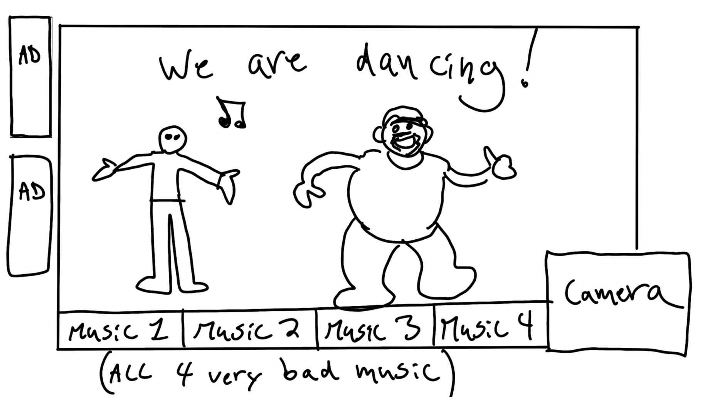
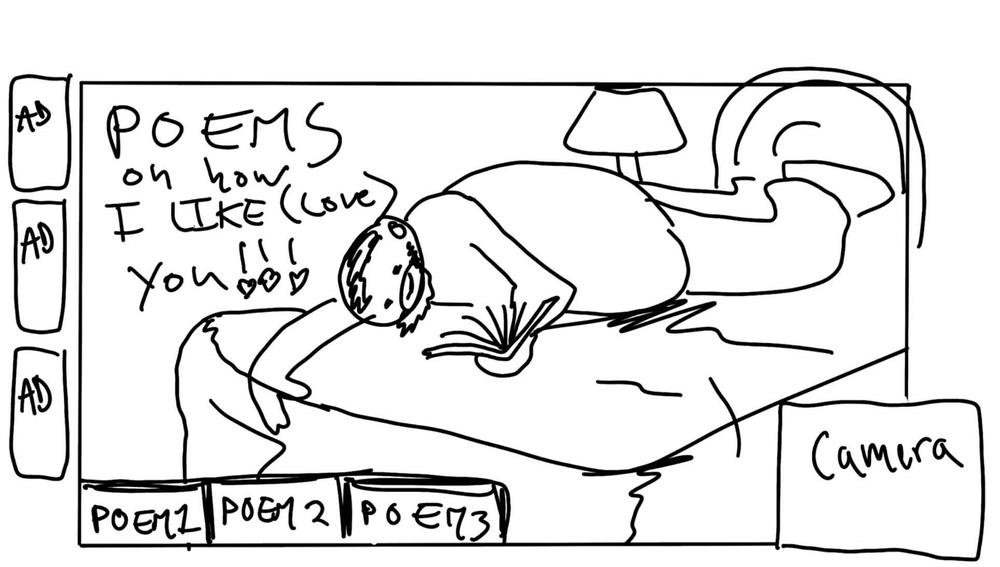

# CART-211 FINAL PROJECT

Author Name

[View this project online](https://aydanmcgrail.github.io/cart-211/finalProject3/)

## Description

For this project I was inspired by my habit of showing my food to the camera of the google display in my parent's kitchen. I imagine that I am making fun of an hypothetical google surveillance worker that is assigned tu survey us through the lens of the device. I feel altgough I can't do much about that person's constant spying, I feel that I take my revenge by showing my stuffed mouth smiling. 

With this situation in mind, I imagined a setting where that surveillance worker is a lonely old loser dude who is finding my joke super funny and has fallen into an obsession and is in love with me. So the website is supposed to be his own creation and contains a ton of pictures of me taken even outside of that google kitchen device. This worker has also accessed my phone and computer to learn all my habits and interests. 

So then the website is supposed to be sent to me as some kind of declaration of love. The worker is done being unknown, he is so sure he knows me so well we will be bound to be best friends... or more.

Here are the ten pages showcasing stuff he assembled together with most likely the help of his AI software to write, arange visually and capture my vibe as inhumanly perfectly as possible. 

here are the images I made at the start of the project of a preview of what the end result could look like.

## Credits

This project uses [p5.js](https://p5js.org).

The psychological and physical traits of bobby and adam were made with the help of chat Gpt. (https://chatgpt.com/)

Some of the artworks are also made by me with meta Ai through messenger. 

The ai images that were animated were made with Fotor. (https://www.fotor.com/apps/ai-video-generator/#from-text)

